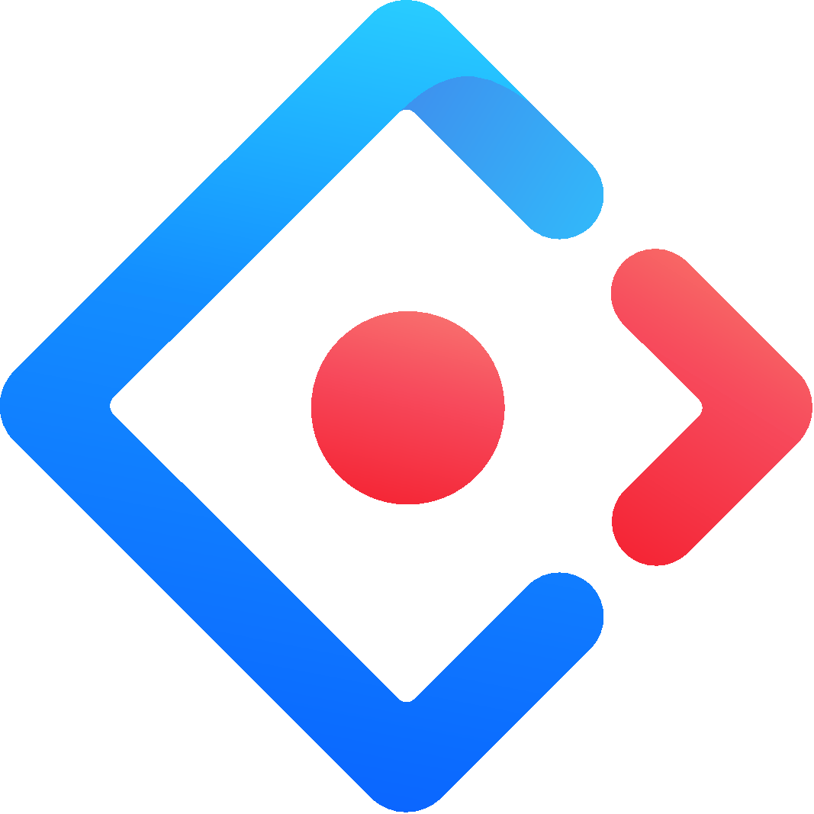

<h3>

Thanks 💙 For Being A Valuable Visitor of My Profile Among

  

  
  

</h3>

 

<h1 align="center" style="text-decoration: none;">🙋‍♂️ Introducing me</h1>

Welcome! It's great to have you here 😊 I hope you're doing well.
 

<h3 style="font-size:18px; font-weight:bold"> I would like to introduce myself as a self taught 🎓 `Web Developer` 💻 💻 💻</h3>

As a self-taught Web Developer, my passion lies in connecting design and development with code to create something practical and useful. Whenever I complete a project, I love to say "Hello World! I've made something for you" 😌

I enjoy sharing my knowledge with others and believe that even small bits of knowledge can lead to big breakthroughs. One of my favorite things to do is to engage in an open discussion on any tech topic over a cup of coffee ☕

If you're interested in connecting and having a discussion with me, I'm always ready to chat! Let's connect 🚀 🚀 🚀

 

## 🕸️ Reach me out

 
 

&nbsp;
&nbsp;
&nbsp;
&nbsp;

 

<h2>Talking about Personal Stuffs 📓</h2>

- 🔭 I’m currently working on building **my own design system**.
- 🌱 I'm currently Learning **Advance Topics of Relational Databases, Backend Development, System Design and SDLC**.
- 🎯 2021 Goals: **Next.js**
- 👯 I’m looking to collaborate on any **NodeJS backend related Open Source Projects**.
- 💬 Ask me about **JS, ReactJS, NodeJS, SQL or No-SQL Database related queestions**. I would be happy to share my knowledge.

 

## 🛠️ I'm skilled at:

&nbsp; &nbsp; &nbsp;
&nbsp; &nbsp; &nbsp;
&nbsp; &nbsp; &nbsp;
&nbsp; &nbsp; &nbsp;
&nbsp; &nbsp; &nbsp;
&nbsp; &nbsp; &nbsp;
&nbsp; &nbsp; &nbsp;
&nbsp; &nbsp; &nbsp;
&nbsp; &nbsp; &nbsp;

 

## :chart_with_upwards_trend: Current Stats

 

  

 

## 📊 My Github Stats:

 

&nbsp;

 

 

  

## 🚀 Languages and Tools:

